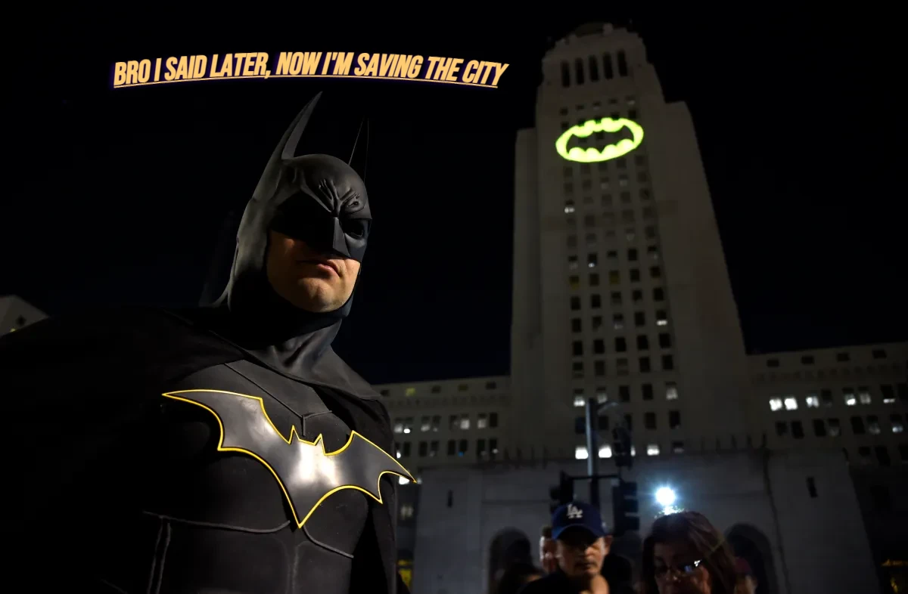

<base target="_blank">

# Data structures and Algorithms

- This is all my learning with along with check list of all the topic i've covered

# Resources i'm referring to
1) [Code Help](https://www.youtube.com/playlist?list=PLDzeHZWIZsTryvtXdMr6rPh4IDexB5NIA)

2) [take U forward](https://www.youtube.com/@takeUforward)

3) [Luv](https://www.youtube.com/@iamluv) 

4) [Priyansh Agarwal](https://www.youtube.com/@PriyanshAgarwal)

5) [Might add more in future....](https://www.youtube.com/watch?v=dQw4w9WgXcQ)

6) 

# Checklist of the topics i've done

- [x] Basics
- [] Basic maths in c++
- [x] Leacture_1 (flow charts and algo)
- [x] Leacture_2 (Writing first program)
- [x] Leacture_3 (if-else)
- [x] Leacture_4 (Pattern)
  - [x] Pattern solving problems(kinda suck at it) 
  - [x] mostly done with patters
- [x] Leacture_5 (Bitwise Operators)
  - [ ] Will do this in more detail
- [x] Leacture_6 (Binary & Decimal Number sys)
- [x] Leacture_7 (Leetcode Problem)
- [x] Leacture_8 (Switch statement)
- [x] Leacture_9 (Introduction to Arrays)
- [ ] Leacture_10 ()
- [ ] Leacture_11
- [ ] Leacture_12
- [ ] Leacture_13
- [] Leacture_14
- [] Leacture_15
- [] Leacture_16
- [] Leacture_17
- [] Leacture_18
- [] Leacture_19
